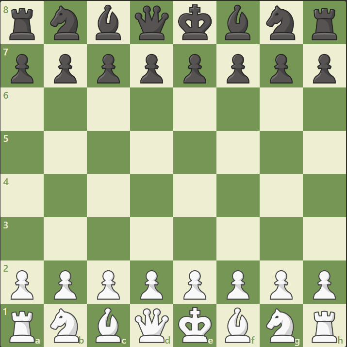

# ChessProject

Coi các quân , ô cờ đều là các đối tượng
Các class: Pawn, Knight, Bishop, Queen, Rock, King, từ đây triển khai cho loại quân trắng và đen

class board bao gồm 64 class cell

Pawn:
-Vị trí trên bàn cờ
-biến lưu trạng thái(có thể di chuyển hoặc không)
-mảng lưu các ô có thể di chuyển tiếp theo: đi thẳng, ăn quân, bắt tốt qua đường
Tính chất :
-không thể đi thẳng nếu bị chặn(cả quân ta và quân đối thủ)
-sẽ được phong cấp nếu ở hàng cuối cùng đối diện
-bắt tốt qua đường: đang ở hàng ngang thứ 5 và đối thủ đi tốt ở 2 cột 2 bên....

Knight:
-Vị trí trên bàn cờ
-biến lưu trạng thái(có thể di chuyển hoặc không)
-mảng lưu các ô có thể di chuyển tiếp theo: 
Tính chất:
-vượt qua các quân khác để đi tới ô hợp lệ

Bishop, Queen, Rock, King, tương tự

